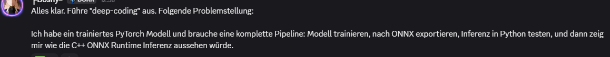
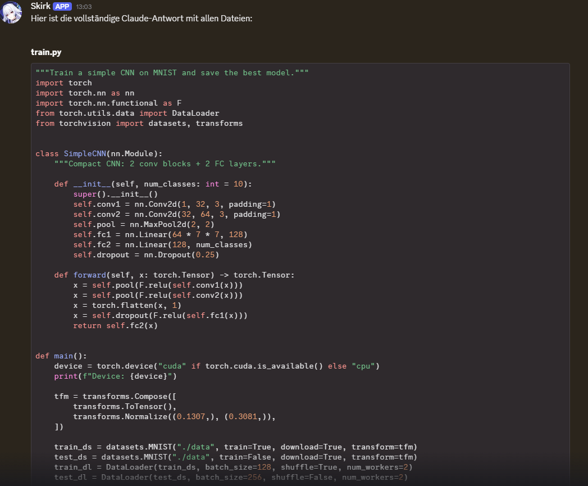
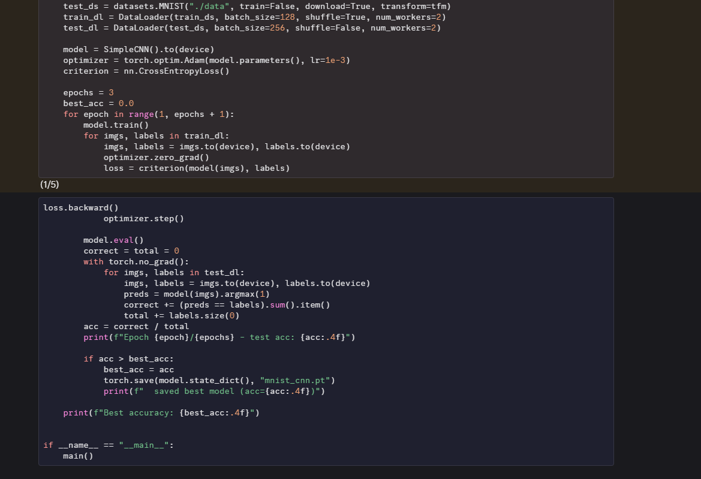
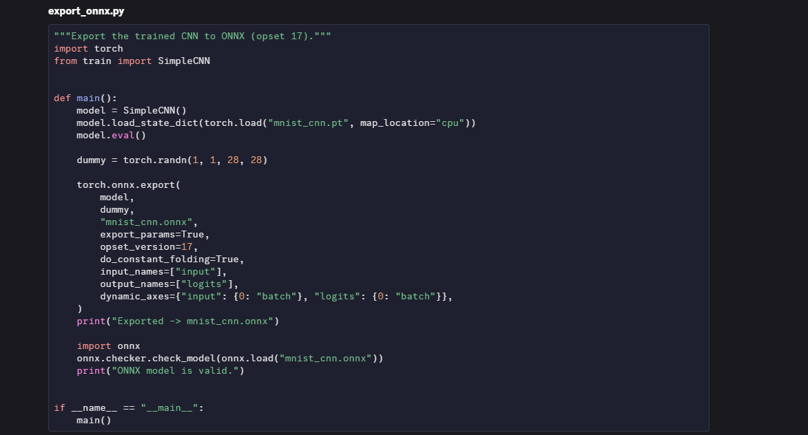
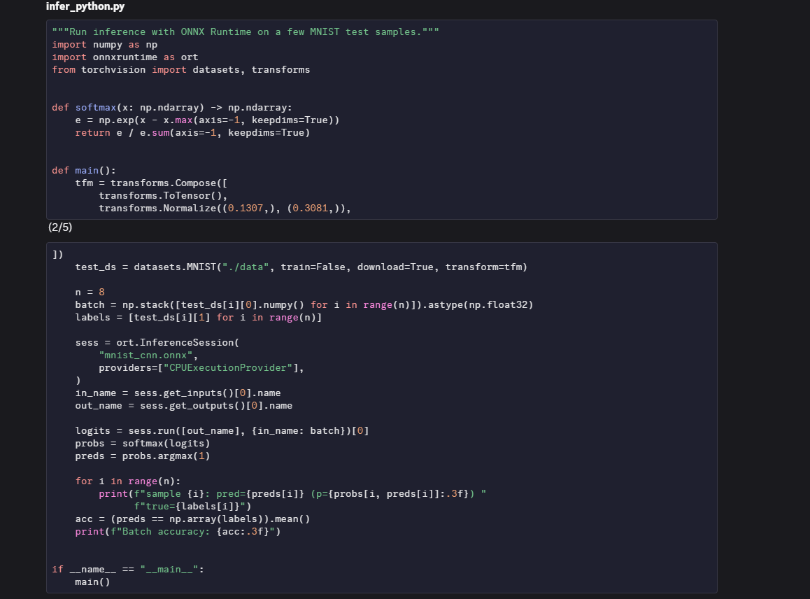
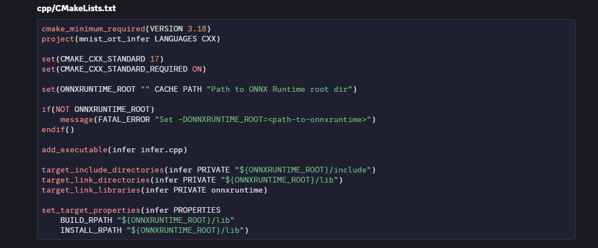
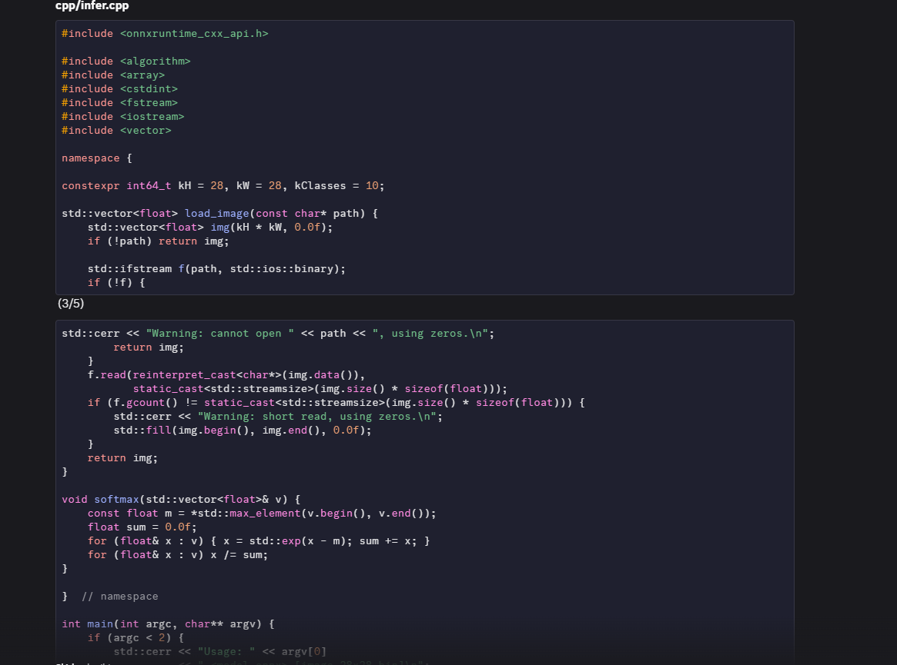
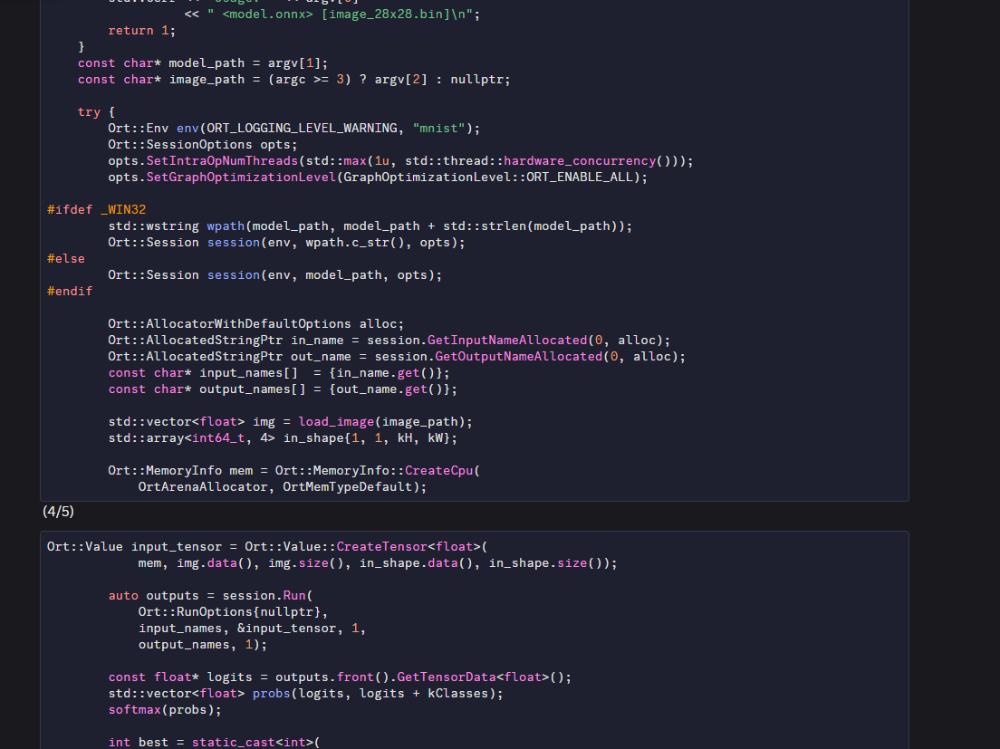
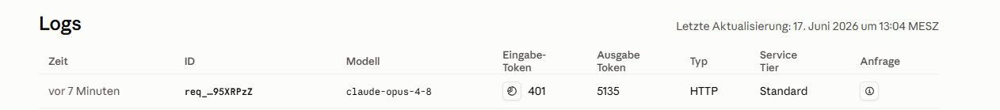

# hermes-system-agent
Autonomous Hermes agent on NVIDIA Jetson Orin Nano for file management, system automation, and AI-powered deep coding via Anthropic API. Supports Image-Gen via XIA-API.

## Deep Coding — ML Pipeline Example

The user sends a request directly in Discord. Agent preprocesses 
it and forwards it to Claude Opus 4.8 via the Anthropic API.

Agent returns the full response split across multiple messages (because of character limit per message).
Here is the PyTorch training script:

ONNX export and Python inference:

C++ ONNX Runtime inference with CMakeLists:

Cost report and Anthropic Console verification. You see that Cost report & Anthropic Console show exact same Token Count, confirming correct Token & Cost Calculation:

